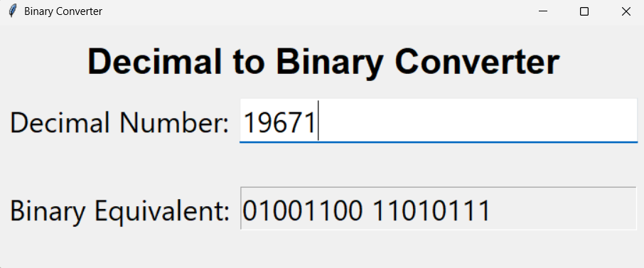

# Decimal to Binary Converter

A lightweight desktop GUI that converts decimal integers to binary in real time, built with Python and Tkinter.

---

## Features

- Live conversion — updates as you type
- Input validation with clear error messages
- Supports negative numbers (sign-magnitude representation)
- Read-only output field — selectable and copyable, not editable
- Supports numbers in the range **−8,388,607 to 16,777,215** (24-bit)

---

## Requirements

- Python 3.x
- Tkinter (bundled with standard Python installations)

---

## Usage

Enter a decimal integer in the input field. The binary equivalent appears instantly.

---

## Input Constraints

| Condition | Response |
|---|---|
| Empty input | Resets output to `00000000` |
| Non-integer | `Error. Enter an integer` |
| Greater than 16,777,215 | `Error. Number too big` |
| Less than −8,388,607 | `Error. Number too small` |

---

## License

MIT
